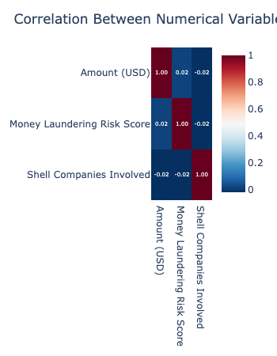
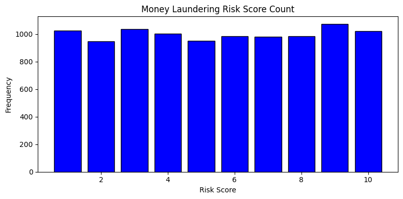
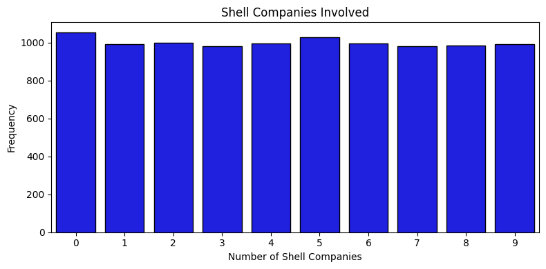
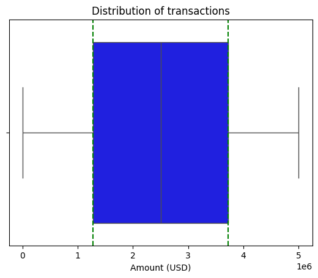
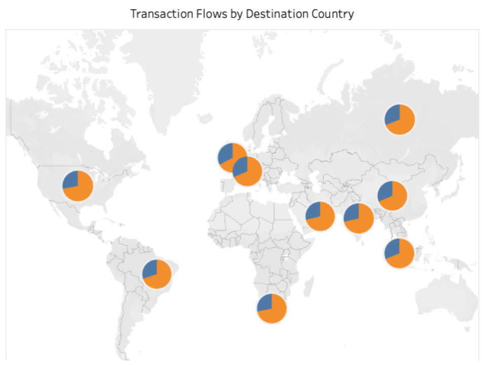
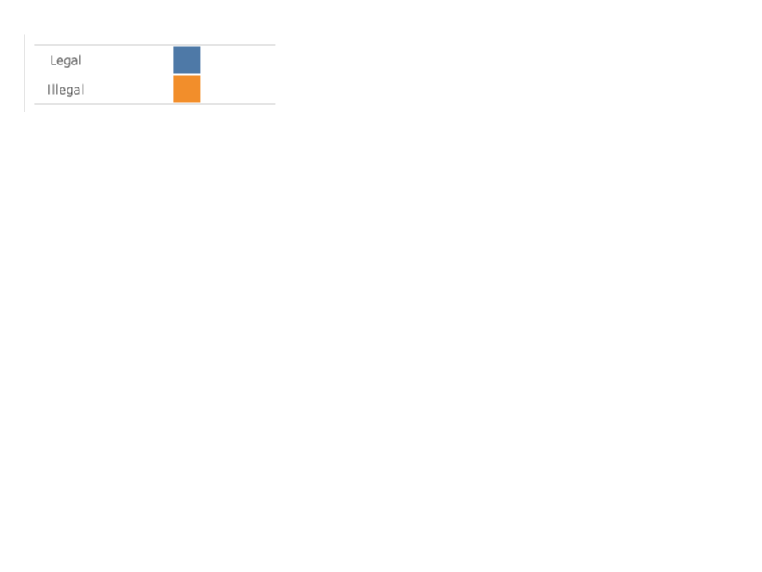
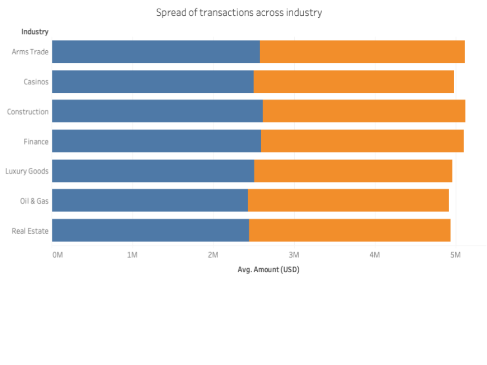
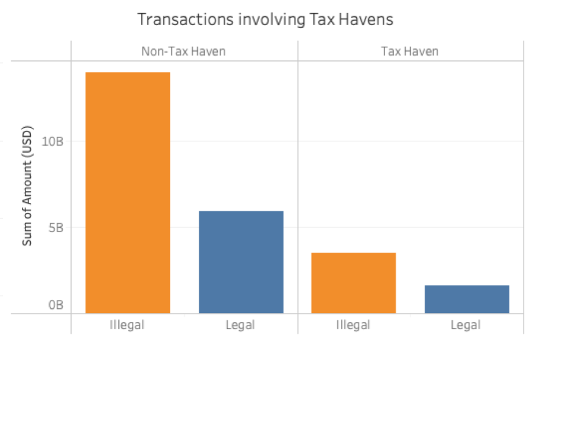
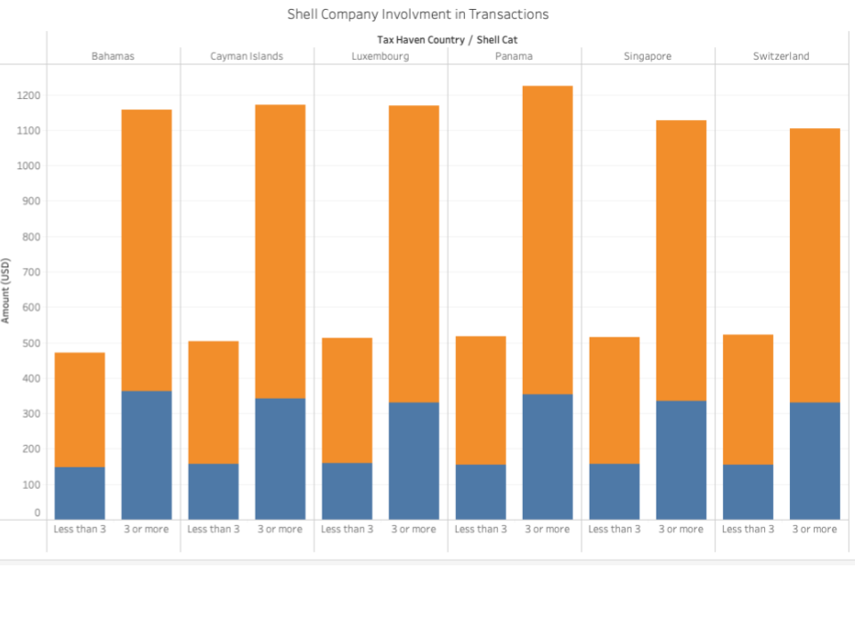

# Detecting Money Laundering Patterns Across Global Financial Transactions

## Table of Contents
1. [Overview](#overview)
2. [The Dataset](#dataset-description)
3. [Key Objectives](#key-objectives)
4. [Methodology](#methodology)
5. [Analysis & Findings](#analysis--findings)
6. [Dashboard Features]**Correlation Between Numerical Values**

ashboard-features)
7. [AI Tool Integration](#ai-tool-integration)
8. [Ethical & Legal Considerations](#ethical--legal-considerations)
9. [Challenges & Reflections](#challenges--reflections)
10. [Assessment Criteria](#assessment--criteria)

##  1. Overview
### 1.1 Problem Statement

Money laundering is a significant and growing global issue that directly funds organized crime and terrorism. While the true scale of money laundering is difficult to quantify, the United Nations Office on Drugs and Crime (UNODC) estimates that between 2% and 5% of global GDP is laundered each year—equivalent to EUR 715 billion to 1.87 trillion annually.

To combat this, banks and financial institutions worldwide are subject to regulations at both national and international levels. The responsibility to detect and report money laundering activities falls on corporate institutions globally, although the effectiveness of these efforts varies.

When institutions fail to comply with anti-money laundering (AML) regulations, the consequences can be severe. In June 2025, for example, the Monetary Authority of Singapore issued a record fine of $1.6 billion in a high-profile laundering case that damaged the city's financial reputation.

Beyond financial penalties, money laundering poses a direct threat to the profitability and reputation of institutions and contributes to long-term societal harm by enabling criminal networks that destabilize communities worldwide.

In the United Kingdom, the Proceeds of Crime Act 2002 requires financial institutions to implement risk-based customer due diligence approach and take proactive measures to prevent their services from being used for money laundering or terrorist financing.
This project investigates synthetic financial transaction data to identify patterns indicative of money laundering, drawing on datasets that span multiple countries, industries, and transaction types.

## 2. Dataset 
This project explores synthetic financial transaction data, modelled on real data to detect patterns consistent with money laundering activity. Using data spanning multiple countries across the world, industries, and transaction types, we apply statistical methods, risk scoring, and machine learning models to identify patterns of behavior associated with money laundering. 

The objective is to identify anti-money laundering (AML) insights and recommendations by highlighting suspicious transaction profiles with a view to informing and improving financial compliance workflows.

All data used has been generated for research purposes mimicking the complexity and structure of real-world financial transactions. 

### 2.1 Dataset Source
https://www.kaggle.com/datasets/waqi786/global-black-money-transactions-dataset

### 2.2 Dataset 
Money_Laundering_Dataset_.csv (10,000 records X 14 columns)

### 2.3 Dataset Columns

| Column Name                    | Description                                                                 |
|-------------------------------|-----------------------------------------------------------------------------|
| **Transaction ID**            | A unique identifier for each financial transaction.                        |
| **Country**                   | The country where the transaction was initiated.                           |
| **Amount (USD)**              | The monetary value of the transaction in U.S. dollars.                     |
| **Transaction Type**          | The nature of the transaction (e.g., deposit, withdrawal, transfer).       |
| **Date of Transaction**       | The date on which the transaction occurred.                                |
| **Person Involved**           | An anonymised label representing the individual associated with the transaction. |
| **Industry**                  | The industry sector associated with the person or organisation involved.   |
| **Destination Country**       | The country where the funds were sent or intended to be received.          |
| **Reported by Authority**     | Indicates whether the transaction was reported to a regulatory or financial authority. |
| **Source of Money**           | The declared or inferred origin of the funds involved in the transaction.  |
| **Money Laundering Risk Score** | A numerical or categorical score assessing the potential risk of money laundering. |
| **Shell Companies Involved**  | Indicates whether shell companies were linked to the transaction.          |
| **Financial Institution**     | An anonymised identifier for the financial institution handling the transaction. |
| **Tax Haven Country**         | Specifies whether the transaction is connected to a known tax haven jurisdiction. |

*Date of transactions - transactions span a two-year period from 2013 - 2014. We will carry out a data shift to 2023/ 2024 during the ETL process to enable the analysis of any seasonality variations within the dataset. 

## 3. Key Objectives 

- Identify behavioural patterns and proxy patterns linked to money laundering. 
- Test key hypotheses using the data set 
Visualise findings through interactive Tableau dashboards
- Translate insights into actionable business recommendations.
- Develop and evaluate machine-learning models, a supervised classifiers (e.g., logistic regression, random forest).

## 4. Business Requirements 
This project supports stakeholder decision-making with clear, data-driven insights into the drivers patters of behaviour around money laundering. 

## 5. Key Business Goals
Identify adequate processes and procedures to better comply with anti-money laundering regulations, at the domestic and international level. 

## 5. Hypothesis 

| # | Hypothesis | Business Question | Why it Matters | Type of Analysis |
|---|--------------------------------------|-------------------------|----------------|-------------------|
| 1 | Cross-border transactions are more often associated with legal sources of funds compared to domestic transactions. | Are intra-country transactions more likely to be illegal, costing the business money? | Consequences for the business in terms of reputation, government fines, profitability, and shareholder satisfaction. | Comparative |
| 2 | Illegal transactions are more common in high-risk sectors such as Casinos and Luxury Goods. | Can we identify industries where transactions are more likely to be fraudulent? | Enables more effective monitoring of high-risk sectors to prevent money laundering. | Comparative |
| 3 | Cross-border transactions involving tax haven countries are more likely to be associated with illegal sources of money. | Should transactions involving tax havens be flagged as higher risk? | Allows AML teams to focus efforts on transactions involving known high-risk jurisdictions. | Comparative |

## 5. Methodology 
### 5.1  Project Plan
A structured data analysis workflow ensured traceability from business objectives to actionable insights.
### High-Level Steps
**- Data Collection**  – Source from Kaggle

**- Data Processing** – Clean, transform, encode
Exploratory Data Analysis and hypothesis testing.

**- Visualisations** – Built with Tableau

**- Tools**
Python in VS Code (ETL and feature engineering)

-GitHub (Version Control)

-Tableau (Interactive Dashboard and visualisation)

-Modelling Clustering / classification (e.g., decision trees, isolation forest)

### 5.2. Extract Transform and Load 

A structured ETL pipeline was implemented to ensure clean, analysis-ready data. The ETL (Extract, Transform, Load) process involved:

5.2.1 1. **Data Cleaning:** Checking for irregularities across the dataset which could hinder analysis, including missing values spelling errors, datetime parsing, normalisation. Removing columns that are not needed for the analysis. i.e. Transaction Number: (TX0000000001). And keeping the size of the file to a manageable size, so that analysis tools such and Power BI and Tableau can handle the file size. Review records where “duplicates” appear. Are these duplicates appropriate or do they demonstrate something about the data. Monetary values are reduced down to zero decimal places as we are dealing seven figure transactions, it is safe to drop any additional small values.

2. **Exploratory Data Analysis :**  Focused on the numerical columns within the dataset. `Amount USD`, `Money Laundering Risk Score` and `Number of Shell Companies Involved`. Initial Analysis involves descriptive sttastics , mean, media and mode, outlier detection to identify and values which may skew the analysis or prevent stastical tests being carried out. Distribution plots will assess the spread of the data. 

2. **Exploratory Data Analysis :**  Focused on the numerical columns within the dataset. `Amount USD`, `Money Laundering Risk Score` and `Number of Shell Companies Involved`. Initial Analysis involves descriptive sttastics , mean, media and mode, outlier detection to identify and values which may skew the analysis or prevent stastical tests being carried out. Distribution plots will assess the spread of the data. 

 
4. `Domestic vs Cross-Border Transaction` Purpose: Quickly identifies if a transaction stays within the same country or goes across borders. Method: Compare Country with Destination Country. 
 

5. `Origin Country Category` (Income & Regulation Bins). Based on UN classifications, World Bank income levels, and FATF regulatory status, countries can be grouped into three bins: 
 

|Country| Origin Country Bin| 
|----------|--------------------------------------------------------| 
|**Brazil**| Upper-Middle Income / Moderate Regulation| 
|**China**|Upper-Middle Income / Strict Regulation| 
|**UK**| High Income / Strong Regulation| 
|**UAE**|High Income / Low Transparency / Risk Zone| 
|**South Africa**| Upper-Middle Income / Moderate Regulation| 
|**Russia**| High Income / High Risk| 
|**Switzerland**|High Income / Strong Regulation| 
|**India**| Lower-Middle Income / Developing 
|**USA**|High Income / Strong Regulation| 
|**Singapore**|High Income / Tax Haven / Risk Zone| 
 

`Destination Country Category` (Based on Similar Risk/Income Profiles) 
 

| Origin Country Category          | Countries | 
|----------------------------------|----------------------| 
| High Income / Regulated          | USA, UK, Switzerland | 
| High Income / Tax Haven          | Singapore, UAE | 
| Upper-Middle / Regulated         | South Africa  | 
| Upper-Middle / Partial Regulated | China, Brazil | 
| Lower-Middle / Partial Regulated | India | 
| Upper-Middle / High Risk         | Russia  | 

## 4. Analysis & Findings 
 

### Descriptive Analysis: 
 

`Amount (USD)` 
 

* **Mean**: 2,501,817. On average, transactions involve about \$2.5 million. 
* **Median**: 2,501,310. The middle transaction amount is also about \$2.5 million, close to the mean, so the distribution might be roughly symmetric. 
* **Mode**: 2,655,927. The most common transaction amount is about \$2.65 million. 
* **Max**: 4,999,812. The largest transaction is nearly \$5 million. 
* **Standard Deviation**: 1,424,364. There is a high spread in transaction amounts, but because mean ≈ median, it suggests the spread isn't caused by strong outliers. 
* **25%**: 1,279,005.25 — 25% of all transactions fall below this amount. This shows what a “low-end” transaction looks like within the dataset. 
* **50%**: 2,501,310.50 — This is the **median**, meaning half the transactions are below this value and half are above. It's useful for understanding the "typical" transaction. 
* **75%**: 3,722,416.75 — 75% of transactions are below this amount, and 25% are above. This highlights what a relatively large transaction looks like within the context of the data. 
* **Skewness**: \~0.01. The distribution is nearly symmetrical. 
* **Kurtosis**: -1.17. The distribution is flatter than normal, meaning fewer extreme outliers than expected in a bell curve. 
 

--- 
 

`Reported by Authority` (Boolean: True = reported, False = not) 
 

* **Mean**: 0.2005. About **20%** of transactions were reported by authorities. 
* **Median**: 0.0. More than half of the transactions were **not reported**. 
* **Mode**: False. The most common value is **False**, confirming most cases are unreported. 
* **Max**: True. Some transactions were reported. 
* **Standard Deviation**: 0.400. Reflects a mix of True and False values but skewed toward False. 
* **25%**: 0.0 — At least 25% of the values are unreported. 
* **50%**: 0.0 — The median again confirms that at least half are unreported. 
* **75%**: 0.0 — Even 75% of the values are False (not reported), which shows that only a small minority were flagged by authorities. 
* **Skewness**: 1.50. Strong **right skew** — very few 1s (True values). 
* **Kurtosis**: 0.24. Slightly peaked compared to a normal distribution. 
 

**Conclusion**: Most transactions go unreported; this variable could help flag rare, suspicious activity. 
 

--- 
 

`Money Laundering Risk Score` (0–10 scale) 
 

* **Mean**: \~5.53. Average risk score is around 5.5. 
* **Median**: 6. Half the transactions have a score below 6, half above. 
* **Mode**: 9. Most common score is **9**, suggesting many high-risk transactions. 
* **Max**: 10. Some transactions score the maximum risk. 
* **Standard Deviation**: 2.89. There's a reasonable spread of scores. 
* **25%**: 3.0 — One-quarter of transactions are low-risk (below 3). 
* **50%**: 6.0 — The median; half of all transactions score below 6, half above. 
* **75%**: 8.0 — 25% of transactions have risk scores **higher than 8**, indicating a significant tail of high-risk activity. 
* **Skewness**: \~-0.01. Very slight **left skew**, almost symmetric. 
* **Kurtosis**: -1.24. Flatter distribution — values more evenly spread than a bell curve. 
 

--- 
 

`Shell Companies Involved` (0–9) 
 

* **Mean**: \~4.47. On average, \~4.5 shell companies are involved per transaction. 
* **Median**: 4. Half of transactions involve **4 or fewer** shell companies. 
* **Mode**: 0. Many transactions involve **no** shell companies at all. 
* **Max**: 9. Some transactions involve up to **9** shell companies. 
* **Standard Deviation**: 2.88. Moderate variability in number of shell companies involved. 
* **25%**: 2.0 — A quarter of transactions involve 2 or fewer shell companies. 
* **50%**: 4.0 — The median; half of all transactions involve fewer than 4 shell companies. 
* **75%**: 7.0 — A quarter of all transactions involve 7 or more shell companies — potentially suspicious activity. 
* **Skewness**: \~0.01. Almost symmetrical distribution. 
* **Kurtosis**: -1.22. Flat distribution with fewer outliers. 

**Money Laundering Risk Score** 

There is an even spread of the risk scores based on the frequency they appear across transactions. 

The mean risk scores across each industry are equally similar:

| Industry | Mean Risk Score |
|----------|-----------------|
| Luxury Goods | 5.373544 |
| Oil & Gas | 5.427843 |
| Real Estate | 5.455301 |
| Casinos | 5.556282 |
| Arms Trade | 5.570721 |
| Construction | 5.583562 |
| Finance | 5.711864 |
---

**Shell Companies Involved**

Even spread of shell companies involved in transactions ranging from 0-9. 

**Distribution of Transactions** 

The mid point of transactions is $2.5 million dollars, the upper whisker is five million with no outliers and the smallest transaction is $1.5 million with no outliers. 

# Advanced Analytics 

### Hypothesis Testing Summary and Statistical Validation

### The Pearson Correlation Test.

The Pearson correlation test is used to measure the linear relationship between two continuous numerical variables in the dataset. This test will show whether increases in one variable are associated with increases or decreases in another.

**Result:**
The result is a correlation coefficient (r) between -1 and 1:
+1: Perfect positive linear relationship
0: No linear relationship
-1: Perfect negative linear relationship
It also returns a p-value, which tells you if the correlation is statistically significant (typically, p < 0.05 means significant).

**Requirements for Pearson Correlation**
To ensure accurate results, the dataset should meet the following:
- Variables must be numeric and continuous (e.g., price, distance, temperature)
- Linear relationship between variables
- No significant outliers that distort the result
Data should be roughly normally distributed (especially for significance testing).

### Correlation Summary of Numerical Variables

| Variable Pair                  | Correlation Coefficient | Interpretation |
|------------------------------------------|--------------------------|----------------|
| Amount (USD) & Risk Score                | 0.0165                   | Very weak positive correlation – almost no relationship |
| Amount (USD) & Shell Companies Involved  | -0.0179                  | Very weak negative correlation – almost no relationship |
| Risk Score & Shell Companies Involved    | -0.0193                  | Very weak negative correlation – almost no relationship |
---

These results indicate that there is **no meaningful linear relationship** between these variables. For instance, larger transaction amounts are **not necessarily** associated with higher risk scores or more shell companies. This suggests that the `Money Laundering Risk Score` may be influenced more by other factors, such as `Industry`, `Country`, or whether the transaction was `Reported by Authority`.

**Correlation Between Numerical Values**

In order to calculate the relationships with categorical data, we'll explore the Chi Squared test,  which is a statistical method used to determine if there is a significant association between two categorical  variables. This test will help us understand if the distribution of one categorical variable differs significantly across the levels of another categorical variable.

###  Chi-Squared Test Summary

| Category 1        | Category 2              | Chi-Squared Statistic | Degrees of Freedom | P-Value   | Significant? (α = 0.05) |
|-------------------|-------------------------|------------------------|--------------------|-----------|-------------------------|
| Industry          | Reported by Authority   | 12.7965                | 6                  | 0.0464    | Yes   |
| Shell Cat | Reported by Authority | 3.5725| 1| 0.0587| No|
| Transaction Type | Tax Haven Country | 41.2689| 20| 0.0034| Yes 

**Industry / Reported by Authority**

The analysis showed a statistically significant relationship between the type of industry and whether a transaction was reported by an authority (χ² = 12.80, df = 6, p = 0.0464). This suggests that certain industries are more likely to trigger regulatory reports, possibly due to inherent risk profiles or regulatory scrutiny.

**Shell Category / Reported by Authority**

The association between the number of shell companies involved in a transaction and being reported was not statistically significant (χ² = 3.57, df = 1, p = 0.0587). Although close to the 0.05 threshold, this result implies no strong evidence that shell company alone significantly impacts reporting rates in this sample. In that this category combined with another may provide more insight. 

**Transaction Type / Tax Haven Country**

A highly significant relationship was found between the type of transaction and whether it involved a tax haven destination (χ² = 41.27, df = 20, p = 0.0034). This indicates that certain transaction types are more likely to involve tax haven countries, supporting risk-based hypotheses in AML (Anti-Money Laundering) analysis.

## Hypothesis Testing Summary and Statistical Validation
This report summarises the findings of three hypotheses tested using the data to understand the drivers of credit card churn. Each hypothesis is evaluated with its outcome, reasoning, and actionable recommendations.

| 1 | Cross-border transactions are more often associated with legal sources of funds? 
In 2023, $25.02 billion in international transactions were recorded across ten countries. Of these, 90.1% were cross-border, while 9.9% were domestic.

Of that 90.1% of  total transactions, at least 60% of transactions for all 10 countries are illegal.. This supports the hypothesis that the largest proportion of cross-boarder transactions are illegal. 

| 2 | Illegal transactions are more common in high-risk sectors such as Casinos and Luxury Goods.

| 3 | Cross-border transactions involving tax haven countries are more likely to be associated with illegal sources of money. 

The data shows that the hightest proportion of trsactions across the course of the year, 2023 does not involve tax haven countries. $14B was laundered in 2023 involving ten countries that did not involve a tax havens.

The data set provided the range of shell companies associated with a transaction from 0- 9. Transactions where three or more shell companies involved is a red flag. The histogram shows that a disporotionally high proportion of illegal trsactions are associated with three or more shell companies 

