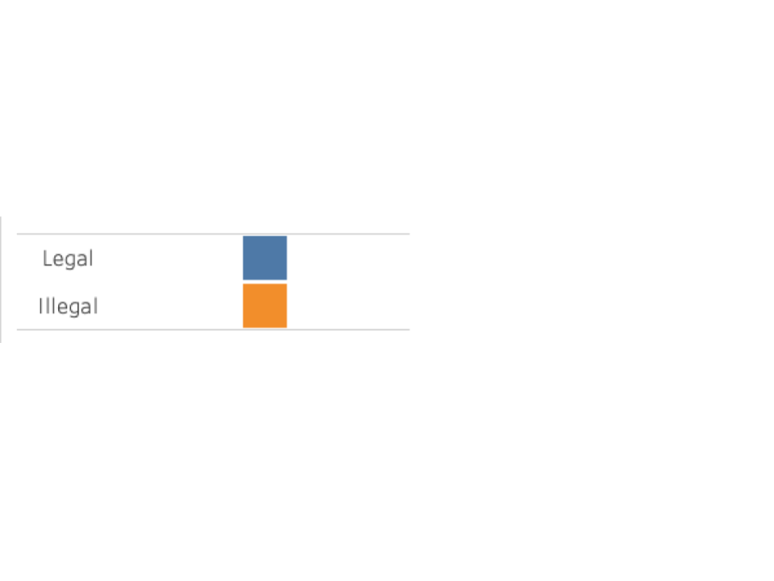

# Detecting Money Laundering Patterns Across Global Financial Transactions

## Table of Contents

##  1. Overview
### 1.1 Problem Statement

Money laundering is a significant and growing global issue that directly funds organized crime and terrorism. While the true scale of money laundering is difficult to quantify, the United Nations Office on Drugs and Crime (UNODC) estimates that between 2% and 5% of global GDP is laundered each year—equivalent to EUR 715 billion to 1.87 trillion annually.

To combat this, banks and financial institutions worldwide are subject to regulations at both national and international levels. The responsibility to detect and report money laundering activities falls on corporate institutions globally, although the effectiveness of these efforts varies.

When institutions fail to comply with anti-money laundering (AML) regulations, the consequences can be severe. In June 2025, for example, the Monetary Authority of Singapore issued a record fine of $1.6 billion in a high-profile laundering case that damaged the city's financial reputation.

Beyond financial penalties, money laundering poses a direct threat to the profitability and reputation of institutions and contributes to long-term societal harm by enabling criminal networks that destabilize communities worldwide.

In the United Kingdom, the Proceeds of Crime Act 2002 requires financial institutions to implement risk-based customer due diligence approach and take proactive measures to prevent their services from being used for money laundering or terrorist financing.
This project investigates synthetic financial transaction data to identify patterns indicative of money laundering, drawing on datasets that span multiple countries, industries, and transaction types.

## 2. The Dataset 
This project explores synthetic financial transaction data, modelled on real data to detect patterns consistent with money laundering activity. Using data spanning multiple countries across the world, industries, and transaction types, we apply statistical methods, risk scoring, and machine learning models to identify patterns of behavior associated with money laundering. 

The objective is to identify anti-money laundering (AML) insights and recommendations by highlighting suspicious transaction profiles with a view to informing and improving financial compliance workflows.

All data used has been generated for research purposes mimicking the complexity and structure of real-world financial transactions. 

### 2.1 Dataset Source
https://www.kaggle.com/datasets/waqi786/global-black-money-transactions-dataset

### 2.2 Dataset 
Money_Laundering_Dataset_.csv (10,000 records X 14 columns)

### 2.3 Dataset Columns

| Column Name                    | Description                                                                 |
|-------------------------------|-----------------------------------------------------------------------------|
| **Transaction ID**            | A unique identifier for each financial transaction.                        |
| **Country**                   | The country where the transaction was initiated.                           |
| **Amount (USD)**              | The monetary value of the transaction in U.S. dollars.                     |
| **Transaction Type**          | The nature of the transaction (e.g., deposit, withdrawal, transfer).       |
| **Date of Transaction**       | The date on which the transaction occurred.                                |
| **Person Involved**           | An anonymised label representing the individual associated with the transaction. |
| **Industry**                  | The industry sector associated with the person or organisation involved.   |
| **Destination Country**       | The country where the funds were sent or intended to be received.          |
| **Reported by Authority**     | Indicates whether the transaction was reported to a regulatory or financial authority. |
| **Source of Money**           | The declared or inferred origin of the funds involved in the transaction.  |
| **Money Laundering Risk Score** | A numerical or categorical score assessing the potential risk of money laundering. |
| **Shell Companies Involved**  | Indicates whether shell companies were linked to the transaction.          |
| **Financial Institution**     | An anonymised identifier for the financial institution handling the transaction. |
| **Tax Haven Country**         | Specifies whether the transaction is connected to a known tax haven jurisdiction. |

*Date of transactions - transactions span a two-year period from 2013 - 2014. We will carry out a data shift to 2023/ 2024 during the ETL process to enable the analysis of any seasonality variations within the dataset. 

## 3. Key Objectives 

- Identify behavioural patterns and proxy patterns linked to money laundering. 
- Test key hypotheses using the data set 
Visualise findings through interactive Tableau dashboards
- Translate insights into actionable business recommendations.
- Develop and evaluate machine-learning models, a supervised classifiers (e.g., logistic regression, random forest).

## 4. Business Requirements 
This project supports stakeholder decision-making with clear, data-driven insights into the drivers patters of behaviour around money laundering. 

## 5. Key Business Goals
Identify adequate processes and procedures to better comply with anti-money laundering regulations, at the domestic and international level. 

## 6. Hypothesis 

| # | Hypothesis | Business Question | Why it Matters | Type of Analysis |
|---|--------------------------------------|-------------------------|----------------|-------------------|
| 1 | Cross-border transactions are more often associated with legal sources of funds compared to domestic transactions. | Are intra-country transactions more likely to be illegal, costing the business money? | Consequences for the business in terms of reputation, government fines, profitability, and shareholder satisfaction. | Comparative |
| 2 | Illegal transactions are more common in high-risk sectors such as Casinos and Luxury Goods. | Can we identify industries where transactions are more likely to be fraudulent? | Enables more effective monitoring of high-risk sectors to prevent money laundering. | Comparative |
| 3 | Cross-border transactions involving tax haven countries are more likely to be associated with illegal sources of money. | Should transactions involving tax havens be flagged as higher risk? | Allows AML teams to focus efforts on transactions involving known high-risk jurisdictions. | Comparative |

## 7. Methodology 
### 7.1.  Project Plan
A structured data analysis workflow ensured traceability from business objectives to actionable insights.

**High-Level Project Plan**

A GitHub project board was created and used to structure the project phases, track progress, and ensure the work was completed on time(https://github.com/users/NAW125/projects/5). The planning drew on project experience and data science workflows, breaking down the work into manageable stages from ideation to delivery.

The first phase involved ideation, selecting a suitable AML dataset, and clearly defining the problem statement. Once the dataset was sourced, the next step was data preparation, which included cleaning, transforming, and encoding the data using Python in VS Code.

This was followed by exploratory data analysis (EDA) and feature engineering across multiple Jupyter notebooks. One notebook was dedicated to EDA and hypothesis testing, while another focused on the preparation and transformation of the dataset for machine learning tasks such as classification.

Tableau was then used to build an interactive dashboard. Despite some limitations on the free tier (e.g., import issues), the visualisations were completed and made to support the hypothesis testing and final insights.

For the modelling stage, a DecisionTreeClassifier was used to build a simple but interpretable machine learning model. Significant time was spent transforming the dataset into a format suitable for scikit-learn, which revealed the need for earlier planning around model requirements.

The README was progressively updated during the project, with a full review and polish once the main analysis and dashboard were complete. It includes final outputs, reflections, ethical considerations, and next steps for future development, including a potential Streamlit-based AML calculator.

### 7.3 Extract Transform and Load 

A structured ETL pipeline was implemented to ensure clean, analysis-ready data. The ETL (Extract, Transform, Load) process involved:

7.3.1 **Data Cleaning:** Checking for irregularities across the dataset which could hinder analysis, including missing values spelling errors, datetime parsing, normalisation. Removing columns that are not needed for the analysis. i.e. Transaction Number: (TX0000000001). And keeping the size of the file to a manageable size, so that analysis tools such and Power BI and Tableau can handle the file size. Review records where “duplicates” appear. Are these duplicates appropriate or do they demonstrate something about the data. Monetary values are reduced down to zero decimal places as we are dealing seven figure transactions, it is safe to drop any additional small values.

7.3.2. **Exploratory Data Analysis :**  Focused on the numerical columns within the dataset. `Amount USD`, `Money Laundering Risk Score` and `Number of Shell Companies Involved`. Initial Analysis involves descriptive sttastics , mean, media and mode, outlier detection to identify and values which may skew the analysis or prevent stastical tests being carried out. Distribution plots will assess the spread of the data. 

7.3.3. **Exploratory Data Analysis :**  Focused on the numerical columns within the dataset. `Amount USD`, `Money Laundering Risk Score` and `Number of Shell Companies Involved`. Initial Analysis involves descriptive sttastics , mean, media and mode, outlier detection to identify and values which may skew the analysis or prevent stastical tests being carried out. Distribution plots will assess the spread of the data. 

 
7.3.4. `Domestic vs Cross-Border Transaction` Purpose: Quickly identifies if a transaction stays within the same country or goes across borders. Method: Compare Country with Destination Country. 
 

7.3.5. `Origin Country Category` (Income & Regulation Bins). Based on UN classifications, World Bank income levels, and FATF regulatory status, countries can be grouped into three bins: 
 

|Country| Origin Country Bin| 
|----------|--------------------------------------------------------| 
|**Brazil**| Upper-Middle Income / Moderate Regulation| 
|**China**|Upper-Middle Income / Strict Regulation| 
|**UK**| High Income / Strong Regulation| 
|**UAE**|High Income / Low Transparency / Risk Zone| 
|**South Africa**| Upper-Middle Income / Moderate Regulation| 
|**Russia**| High Income / High Risk| 
|**Switzerland**|High Income / Strong Regulation| 
|**India**| Lower-Middle Income / Developing 
|**USA**|High Income / Strong Regulation| 
|**Singapore**|High Income / Tax Haven / Risk Zone| 
 

`Destination Country Category` (Based on Similar Risk/Income Profiles) 
 

| Origin Country Category          | Countries | 
|----------------------------------|----------------------| 
| High Income / Regulated          | USA, UK, Switzerland | 
| High Income / Tax Haven          | Singapore, UAE | 
| Upper-Middle / Regulated         | South Africa  | 
| Upper-Middle / Partial Regulated | China, Brazil | 
| Lower-Middle / Partial Regulated | India | 
| Upper-Middle / High Risk         | Russia  | 

## 8. Analysis & Findings 
 

### 8.1. Descriptive Analysis: 
 

8.1.2.`Amount (USD)` 
 

* **Mean**: 2,501,817. On average, transactions involve about \$2.5 million. 
* **Median**: 2,501,310. The middle transaction amount is also about \$2.5 million, close to the mean, so the distribution might be roughly symmetric. 
* **Mode**: 2,655,927. The most common transaction amount is about \$2.65 million. 
* **Max**: 4,999,812. The largest transaction is nearly \$5 million. 
* **Standard Deviation**: 1,424,364. There is a high spread in transaction amounts, but because mean ≈ median, it suggests the spread isn't caused by strong outliers. 
* **25%**: 1,279,005.25 — 25% of all transactions fall below this amount. This shows what a “low-end” transaction looks like within the dataset. 
* **50%**: 2,501,310.50 — This is the **median**, meaning half the transactions are below this value and half are above. It's useful for understanding the "typical" transaction. 
* **75%**: 3,722,416.75 — 75% of transactions are below this amount, and 25% are above. This highlights what a relatively large transaction looks like within the context of the data. 
* **Skewness**: \~0.01. The distribution is nearly symmetrical. 
* **Kurtosis**: -1.17. The distribution is flatter than normal, meaning fewer extreme outliers than expected in a bell curve. 
 

--- 
 

8.1.3.`Reported by Authority` (Boolean: True = reported, False = not) 
 

* **Mean**: 0.2005. About **20%** of transactions were reported by authorities. 
* **Median**: 0.0. More than half of the transactions were **not reported**. 
* **Mode**: False. The most common value is **False**, confirming most cases are unreported. 
* **Max**: True. Some transactions were reported. 
* **Standard Deviation**: 0.400. Reflects a mix of True and False values but skewed toward False. 
* **25%**: 0.0 — At least 25% of the values are unreported. 
* **50%**: 0.0 — The median again confirms that at least half are unreported. 
* **75%**: 0.0 — Even 75% of the values are False (not reported), which shows that only a small minority were flagged by authorities. 
* **Skewness**: 1.50. Strong **right skew** — very few 1s (True values). 
* **Kurtosis**: 0.24. Slightly peaked compared to a normal distribution. 
 

**Conclusion**: Most transactions go unreported; this variable could help flag rare, suspicious activity. 
 

--- 
 

8.1.4. `Money Laundering Risk Score` (0–10 scale) 
 

* **Mean**: \~5.53. Average risk score is around 5.5. 
* **Median**: 6. Half the transactions have a score below 6, half above. 
* **Mode**: 9. Most common score is **9**, suggesting many high-risk transactions. 
* **Max**: 10. Some transactions score the maximum risk. 
* **Standard Deviation**: 2.89. There's a reasonable spread of scores. 
* **25%**: 3.0 — One-quarter of transactions are low-risk (below 3). 
* **50%**: 6.0 — The median; half of all transactions score below 6, half above. 
* **75%**: 8.0 — 25% of transactions have risk scores **higher than 8**, indicating a significant tail of high-risk activity. 
* **Skewness**: \~-0.01. Very slight **left skew**, almost symmetric. 
* **Kurtosis**: -1.24. Flatter distribution — values more evenly spread than a bell curve. 
 

--- 
 

8.1.5. `Shell Companies Involved` (0–9) 
 

* **Mean**: \~4.47. On average, \~4.5 shell companies are involved per transaction. 
* **Median**: 4. Half of transactions involve **4 or fewer** shell companies. 
* **Mode**: 0. Many transactions involve **no** shell companies at all. 
* **Max**: 9. Some transactions involve up to **9** shell companies. 
* **Standard Deviation**: 2.88. Moderate variability in number of shell companies involved. 
* **25%**: 2.0 — A quarter of transactions involve 2 or fewer shell companies. 
* **50%**: 4.0 — The median; half of all transactions involve fewer than 4 shell companies. 
* **75%**: 7.0 — A quarter of all transactions involve 7 or more shell companies — potentially suspicious activity. 
* **Skewness**: \~0.01. Almost symmetrical distribution. 
* **Kurtosis**: -1.22. Flat distribution with fewer outliers. 

8.1.6. **Money Laundering Risk Score** 

There is an even spread of the risk scores based on the frequency they appear across transactions. 

The mean risk scores across each industry are equally similar:

| Industry | Mean Risk Score |
|----------|-----------------|
| Luxury Goods | 5.373544 |
| Oil & Gas | 5.427843 |
| Real Estate | 5.455301 |
| Casinos | 5.556282 |
| Arms Trade | 5.570721 |
| Construction | 5.583562 |
| Finance | 5.711864 |
---

8.1.7 **Shell Companies Involved**

Even spread of shell companies involved in transactions ranging from 0-9. 

8.1.8. **Distribution of Transactions** 

The mid point of transactions is $2.5 million dollars, the upper whisker is five million with no outliers and the smallest transaction is $1.5 million with no outliers. 

# 9. Advanced Analytics 

### 9.1. Hypothesis Testing Summary and Statistical Validation

### 9.1.1. The Pearson Correlation Test.

 The Pearson correlation coefficient is used to measure linear relationships between continuous variables: transaction amount, risk score, and number of shell companies involved.

**Result:**
The result is a correlation coefficient (r) between -1 and 1:
+1: Perfect positive linear relationship
0: No linear relationship
-1: Perfect negative linear relationship
It also returns a p-value, which tells you if the correlation is statistically significant (typically, p < 0.05 means significant).

### Correlation Summary of Numerical Variables

| Variable Pair                  | Correlation Coefficient | Interpretation |
|------------------------------------------|--------------------------|----------------|
| Amount (USD) & Risk Score                | 0.0165                   | Very weak positive correlation – almost no relationship |
| Amount (USD) & Shell Companies Involved  | -0.0179                  | Very weak negative correlation – almost no relationship |
| Risk Score & Shell Companies Involved    | -0.0193                  | Very weak negative correlation – almost no relationship |
---

These results indicate that there is no meaningful linear relationship between these variables. Which is further demonstrated by the correlation matrix below.

This suggests that the `Money Laundering Risk Score` may be influenced more by other categorical factors, such as `Industry`, `Country`, or whether the transaction was `Reported by Authority`.

### 9.2. Chi-Squared Test Summary

To explore relationships between categorical variables, a Chi-Squared Test of Independence was is used. 

| Category 1        | Category 2              | Chi-Squared Statistic | Degrees of Freedom | P-Value   | Significant? (α = 0.05) |
|-------------------|-------------------------|------------------------|--------------------|-----------|-------------------------|
| Industry          | Reported by Authority   | 12.7965                | 6                  | 0.0464    | Yes   |
| Shell Cat | Reported by Authority | 3.5725| 1| 0.0587| No|
| Transaction Type | Tax Haven Country | 41.2689| 20| 0.0034| Yes 

**Industry / Reported by Authority**

The analysis showed a statistically significant relationship between the type of industry and whether a transaction was reported by an authority (χ² = 12.80, df = 6, p = 0.0464). This suggests that certain industries are more likely to trigger regulatory reports, possibly due to inherent risk profiles or regulatory scrutiny.

**Shell Category / Reported by Authority**

The association between the number of shell companies involved in a transaction and being reported was not statistically significant (χ² = 3.57, df = 1, p = 0.0587). Although close to the 0.05 threshold, this result implies no strong evidence that shell company alone significantly impacts reporting rates in this sample. In that this category combined with another may provide more insight. 

**Transaction Type / Tax Haven Country**

A highly significant relationship was found between the type of transaction and whether it involved a tax haven destination (χ² = 41.27, df = 20, p = 0.0034). This indicates that certain transaction types are more likely to involve tax haven countries, supporting risk-based hypotheses in AML (Anti-Money Laundering) analysis.

## 10. Hypothesis Testing Summary and Statistical Validation

This section evaluates three main hypotheses using a combination of visual and statistical analysis.

| 1 | Cross-border transactions are more often associated with legal sources of funds? 
In 2023, $25.02 billion in international transactions were recorded across ten countries. Of these, 90.1% were cross-border, while 9.9% were domestic.

Of that 90.1% of  total transactions, at least 60% of transactions for all 10 countries are illegal.. This supports the hypothesis that the largest proportion of cross-boarder transactions are illegal.This supports the hypothesis that the largest proportion of cross-border transactions are illegal.

| 2 | Illegal transactions are more common in high-risk sectors such as Casinos and Luxury Goods. However, the data shows an equal spread of international transactions across sectors, with no single industry standing out. Therefore, this finding does not appear to support the hypothesis.

| 3 | Cross-border transactions involving tax haven countries are more likely to be associated with illegal sources of money. However, the visualisation shows that the greatest source of funds comes from non-tax haven countries. This finding does not support the hypothesis. 

The data shows that the hightest proportion of transactions across the course of the year, 2023 does not involve tax haven countries. $14B was laundered in 2023 involving ten countries that did not involve a tax havens. This finding does not support the hypothesis.

**10.1 Additional Findings**

Analysis of shell company involvement shows:
A notable spike in illegal transactions where three or more shell companies were involved.
While not statistically significant on its own (per Chi-Squared), the histogram suggests that shell company complexity may still be a red flag when combined with other risk factors.

The boxplot illustrates the distribution of transaction values based on whether transactions were reported by authorities. It reveals that only a small proportion of total transactions are reported, indicating selective or risk-based reporting practices.
Notably, the upper whisker for reported transactions reaches approximately $3.5 billion, whereas the upper whisker for unreported transactions (whether legal or illegal) extends up to $14 billion. This suggests that some of the highest-value transactions go unreported, and that reporting is not solely determined by transaction amount. Instead, it may depend more on other factors such as country of origin, industry, or involvement of high-risk entities.

The full suite of visualisations of the data is located available here.  

| Story Number | Description                         | Link                                                                                                         |
|--------------|-----------------------------------|--------------------------------------------------------------------------------------------------------------|
| 1            | Hypothesis 1 - Cross-border vs Domestic Transactions | [View Story 1](https://public.tableau.com/shared/SKG4XY4W5?:display_count=n&:origin=viz_share_link)            |
| 2            | Hypothesis 2 - Illegal Transactions in High-Risk Sectors | [View Story 2](https://public.tableau.com/shared/SKG4XY4W5?:display_count=n&:origin=viz_share_link)            |
| 3            | Hypothesis 3 - Tax Haven Involvement in Cross-border Transactions | [View Story 3](https://public.tableau.com/views/DetectingMoneyLaunderingPatterns-H2/Hypothesis2?:language=en-GB&:sid=&:redirect=auth&:display_count=n&:origin=viz_share_link) |

## 11. Decision Tree Classification

### 11.1.  Machine Learning: Decision Tree Classification
This section explores whether it's possible to automatically classify transactions as **legal or illegal** using supervised machine learning. Given the structure of the data, with a labelled target variable (`Source of Money_Legal`) and a mix of categorical and numerical features — a **classification model** is appropriate.

### 11.2.  Objective
The goal is to build a predictive model that can identify likely illegal transactions based on features such as:
- Transaction amount
- Risk score
- Country of origin
- Industry
- Transaction type
- Number of shell companies involved.

This can support automated risk flagging in an Anti-Money Laundering (AML) context.

### 11.3 Data Preparation & Preprocessing
- **Categorical variables** were encoded using one-hot encoding to convert them into numerical format suitable for machine learning models.
- The **target variable** is binary:
  - `0` = Illegal
  - `1` = Legal
- The dataset was split into **80% training** and **20% testing** sets to evaluate generalisability.

### 11.4. Baseline Model: Decision Tree Classifier

A `DecisionTreeClassifier` was chosen as a simple, interpretable baseline model. The initial model was trained on the full dataset without balancing the classes.

#### Results (Unbalanced Data)

- **Accuracy:** 57.8%
- Strong performance for illegal transactions (`Precision = 0.70`)
- Poor performance for legal transactions (`Precision = 0.31`)
- Likely impacted by class imbalance (70% of transactions are illegal)
*This highlighted a bias toward the dominant class — illegal transactions — making it unreliable for identifying legitimate activity.*

### 11.5. Improved Model: Balanced Training Data
To address the imbalance, the training dataset was rebalanced to include equal numbers of legal and illegal cases.

####  Results (Balanced Data)
- **Accuracy improved slightly to 59.4%**
- Small gains in precision and recall for legal transactions
- Illegal classification remained relatively strong
> This version offers a more fair and usable baseline for classifying both legal and illegal transactions.

This decision tree map, shows a highly detailed and complex decision making process to identity whether a transaction is fraudulent of not.  

---

### 11.6. XGBoost Classifier

Next, an **XGBoost Classifier** was tested. XGBoost is a gradient boosting algorithm that builds a strong classifier from a series of weak learners, often delivering better performance on structured data.

#### XGBoost Results

- **Accuracy:** 56.4%  
- Performance similar to the decision tree, but slightly lower
- Still biased toward illegal transactions  
- Legal classification remains weak due to limited signal in the data

### 11.7. Interpretation and Next Steps

While the best model achieved an accuracy of just under **60%**, this is a **reasonable baseline** for a complex real-world task like money laundering detection.

Key takeaways:
- The models are good at flagging illegal transactions (which aligns with the project's goal).
- They struggle with legal transaction detection, likely due to data imbalance and limited distinguishing features.
- False positives (flagging legal transactions as illegal) are relatively high, but acceptable at this exploratory stage.

> We'll stop model development at this point, as the current dataset has limitations in class balance, granularity, and feature richness. However, the models lay a solid foundation that can improve significantly with:
> - Updated real time data, to continue to track patterns and activity.
> - More granular features (e.g., transaction time, frequency)

This section demonstrates how even a basic machine learning model can support suspicious transaction detection in a high-risk environment.

## 12. Conclusion 

The relatively even distribution of transaction types, amounts, sectors, and countries suggests that sophisticated money laundering operations are deliberately structured to evade detection. This lack of consistent patterns makes it difficult to apply narrow, targeted AML strategies.
However, there are important subtleties within the data:
- Cross-border transactions are more likely to be fraudulent than domestic ones.
- Transactions involving three or more shell companies show a higher likelihood of being illegal, indicating deliberate attempts to obscure the money trail.
- While many illegal transactions do not involve tax havens, the presence of a tax haven in a transaction increases the probability of fraud even further.
In order to explore whether predictive tools could support detection, a supervised machine learning approach was implemented. A **decision tree classifier** was trained on encoded features from the dataset to classify transactions as **legal or illegal**. Initial results showed reasonable performance in identifying illegal transactions but poor performance in recognising legal ones, due largely to the imbalance in the data. 

> The visualisation of the decision tree (see above) revealed a highly complex structure with many nodes that the decision paths were no longer interpretable — a sign of overfitting and the inherent complexity of modelling suspicious activity from such noisy and balanced data.

Despite these limitations, the model achieved an accuracy of approximately 59%, showing promise for the future. A more advanced model, XGBoost, was also tested. It performed similarly, offering no significant improvement, but helped confirm the baseline potential of machine learning tools in this context.

These insights highlight the complexity and adaptability of modern money laundering practices and reinforce the need for broad, data-driven approaches, including machine learning, if we are to be successful in reducing the amount of money laundering that takes place. With further refinement and more granular, better-balanced data, machine learning models can become critical tools for identifying and flagging high-risk transactions at scale.

## 13. Recommendations 

The analysis reveals that sophisticated money laundering operations are likely in play, carefully designed to avoid detection by varying transaction types, sectors, and amounts. Contrary to traditional assumptions, the data suggests that illicit transactions are not confined to the most obvious red flags. However, several clear patterns and actionable insights emerged that financial institutions can use to strengthen their anti-money laundering (AML) controls:

### 13.1. **Flag Transactions Involving Multiple Shell Companies**

Transactions involving three or more shell companies show a significantly higher likelihood of being linked to money laundering. These should be automatically flagged for enhanced due diligence or review.

### 13.2. **Monitor the Intersection of Shell Companies and Tax Havens**

The risk increases even further when a transaction involves both a tax haven destination and three or more shell companies. These cases should be prioritised for investigation as high-risk.

### 13.3. **Increase Random Spot Checks on International Transactions**

A large proportion of international transactions are associated with illegal activity, yet authorities are underreporting such cases. Financial institutions should increase random spot checks, particularly for transactions:
- In the full range of trsactions, $1 million to $5 million.
- Across all sectors, not just those traditionally seen as high risk

This approach improves the likelihood of identifying suspicious activity by chance and strengthens the institution’s overall detection capabilities.

### 13.4. **Incorporate Machine Learning into AML Pipelines**

While early models like the decision tree and XGBoost classifier showed a good starting place with 59% accuracy. These models have they demonstrated that illegal transactions can be identified with better-than-random accuracy, over time. These models were especially effective at recognising illegal transactions, the stated aim of the model. Whilst in the early days of using such a model will generate incorrect results for legal activities the business risk is low, compared to the volume and impact of allowing large somes of illegal trsactions to continue to go unchecked. 

### 13.5. **Invest in Better Data Labelling and Feature Tracking**

The biggest bottleneck in building effective models is data quality and balance. Efforts should be made to:
- Improve the labelling of transaction outcomes
- Track additional features (e.g., transaction timing, frequency, links to prior suspicious activity)
- Continuously retrain models with new data

These actions will improve the ability to automate detection, reduce false positives, and stay ahead of increasingly complex laundering schemes.

## 14. Ethical Considerations and Privcay 

### 14.1. Ethics and Privacy

All personal and identifiable information has been thoroughly removed from the dataset to ensure the privacy and confidentiality of individuals and institutions involved. 

Specifically:

- **Personal Identifiers:** Names, contact details, account numbers, and any direct personal identifiers have been fully anonymised. For example, individual names have been replaced with generic labels such as Person 123.

- **Institutional Data:** Identifiable information relating to financial institutions, such as bank names or branch identifiers, has also been anonymised, using placeholders like Bank 4833.

 - **Indirect Identifiers:** Care has been taken to avoid inclusion of any combinations of data that could potentially lead to re-identification of individuals or organisations, in accordance with established data protection and ethical research guidelines.

 - **Data Handling:** The data has been stored and handled securely throughout the project, and access has been restricted to authorised personnel only.

- **Data Governance** These steps have been implemented to ensure compliance with ethical research standards and data protection regulations, including GDPR (where applicable), and to respect the privacy of all parties involved.

- **Legal Considerations**The project complies with the General Data Protection Regulation (GDPR) and other relevant data protection laws.
No real-world decisions or actions were taken based on the dataset, and findings are used solely for educational and analytical purposes.
The use of simulated or anonymised data mitigates legal risks associated with data misuse or exposure.
- **Social Impact and Responsibility**
The analysis explores sensitive topics like money laundering and financial crime. Care was taken to avoid reinforcing harmful stereotypes or biases, especially concerning certain industries or jurisdictions. Visualisations and commentary were written with a view to public understanding, fairness, and avoiding undue alarm or reputational harm.
The project advocates for improved transparency and risk detection practices in financial systems without targeting specific regions, people, or organisations.

## 15. Project Reflections 

### 15.1. Learning and Challenges 

A number of challenges were encountered throughout the project, particularly around time series handling, feature engineering, and tool limitations.

**Time-based analysis proved problematic**, especially with inconsistent date formatting and limitations in how Tableau interprets time shifts. This affected the ability to carry out robust time comparisons.

Further **feature engineering** was required to enhance the effectiveness of both visual analysis in Tableau and model training in VS Code/Juypter Notebooks. Several insights became clearer only after substantial trial and error in data transformation.

The **free tier limitations of Tableau** introduced additional constraints. Notably, new datasets could not be imported more than once, requiring unnecessary workarounds and slowing down progress.

One key learning was the importance of having a clearer brief at the start regarding machine learning objectives. A notable amount of time was spent preparing and transforming the dataset for use with `DecisionTreeClassifier`. With better planning, more time could have been allocated to **model tuning**, which would likely have improved classification performance.

Looking ahead, improved model accuracy opens up the possibility of building an **AML risk calculator using Streamlit**, where users can input transaction details and receive a risk assessment indicating whether the transaction is likely to be illegal or not. This could significantly reduce ambiguity in identifying suspicious transactions, helping organisations focus resources to exactly where they are needed.

## 16. Assessment Criteria - Learning Outcomes

| Learning Outcome | Requirement Summary | How Met |
|------------------|---------------------|---------|
| 1.1 | Explain core statistics & probability principles | 4.1 Analysis and Findings |
| 1.2 | Apply principles using relevant examples | 4.1 Analysis and Findings |
| 2.1 | Use Python & tools to manipulate/analyse data | 3.0 Methodology - ETL |
| 2.2 | Evaluate and improve Python code | 11. DecisionTreeClassifier |
| 2.3 | Apply techniques like regression, classification | 11. DecisionTreeClassifier |
| 3.1 | Analyse a real-world dataset | 1.1 Problem Statement |
| 3.2 | Justify your problem-solving approach | Jupyter Notebook markdown |
| 3.3 | Design structured analysis workflow | Jupyter Notebook |
| 4.1 | Use AI tools (e.g. Copilot) in your work | Jupyter Notebook / VS Code |
| 4.2 | Use GenAI to assist with storytelling | 10. Analysis and Findings (Tableau) |
| 4.3 | Identify limitations & alternative solutions | 11. DecisionTreeClassifier |
| 5.1 | Demonstrate effective data processing | Jupyter Notebook |
| 5.2 | Apply data handling best practices | Jupyter Notebook / 14. Ethics and Privacy |
| 6.1 | Reflect on data ethics & privacy | 14. Ethics and Privacy |
| 6.2 | Consider legal/social implications | 14. Ethics and Privacy |
| 7.1 | Organise project & use version control | GitHub |
| 7.2 | Justify research methods chosen | 7. Methodology / Jupyter Notebook |
| 8.1 | Communicate insights clearly | README / Jupyter Notebook |
| 8.2 | Use visualisations & narrative | 10. Analysis and Findings |
| 8.3 | Structure your documentation effectively | README |
| 9.1 | Explore analytics in your domain | 7. Methodology |
| 9.2 | Explain how analytics/AI solves problems | 9. Conclusion and 10. Recommendations |
| 10.1 | Build a project plan with updates & evaluation | GitHub Project Board |
| 10.2 | Reflect on project execution challenges | 15.1 Learning and Challenges |
| 11.1 | Research & experiment with tools/methods | 11. DecisionTreeClassifier |
| 11.2 | Reflect on your learning & next steps | 13. Recommendations / 15.1 Learning and Challenges |

